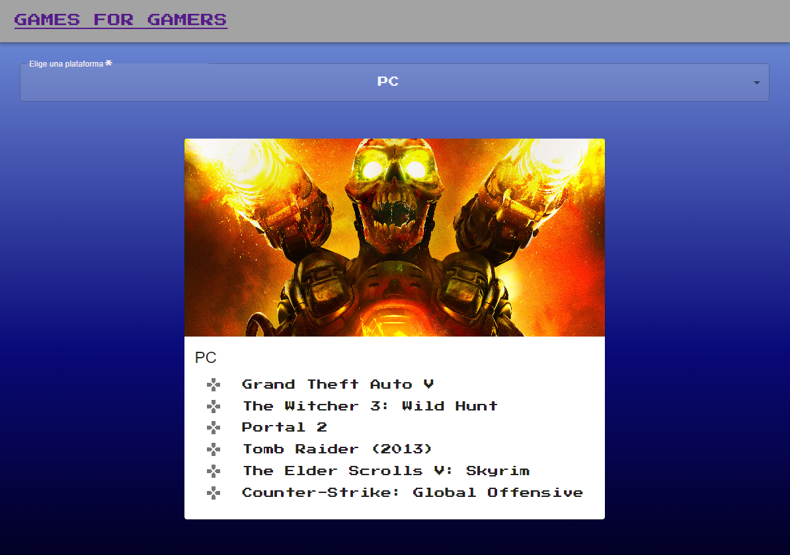

# VideoGame API

Aplicación web simple que permite a los usuarios ver listas de videojuegos dependiendo de la plataforma/consola seleccionada.

## Demo

[Demo](https://namined.github.io/VideoGame-API/)

## ¿Cómo lo ejecuto en local? 🔧

1. Clona este proyecto.
2. Instala las dependencias

### npm install

3. Corre el ambiente local

### npm start

## Construido con 🛠️

Herramientas que utilice:

- React [React](https://es.reactjs.org/)
- Axios [Axios](https://www.npmjs.com/package/axios)
- Material UI [MUI](https://mui.com/)

## Licencia 📄

MIT
